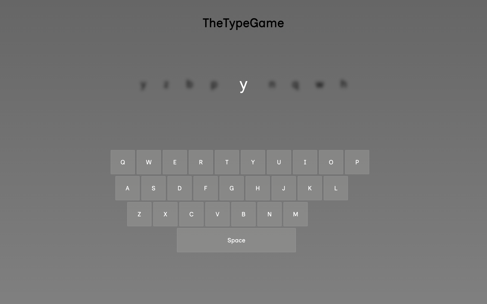

<h1>The Type Game</h1>

Personal front-end project for fun. I enjoy just typing because I find it relaxing. I had an idea to improve my typing speed by testing reaction time per letter. 
I decided I would make my own implementation for practice.

<h2><a href="https://taztheprogrammer.github.io/Calculator/">Website Preview Here</a></h2>

<h2 style="text-align: center">Features</h2>
<ul>
  <li>Reactive keyboard that lights up with the respective key press</li>
  <li>random letter generation and key changes</li>
  <li>Simple design</li>
</ul>
<h2>Outcomes</h2>
<ul>
  <li>Implemented Event Listeners</li>
  <li>CSS animations to make satisfying buttons</li>
  <li>Movement of data using JS</li>
</ul>
<h2>Links</h2>
<ul>
  <li>Next Project <a>coming soon</a></li>
  <li>Previous Project <a href="https://github.com/taztheprogrammer/Etch-a-Sketch">Etch-a-Sketch</a></li>
</ul>
